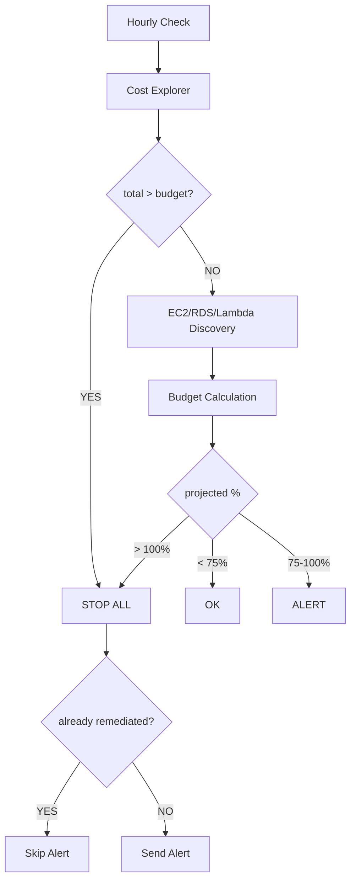
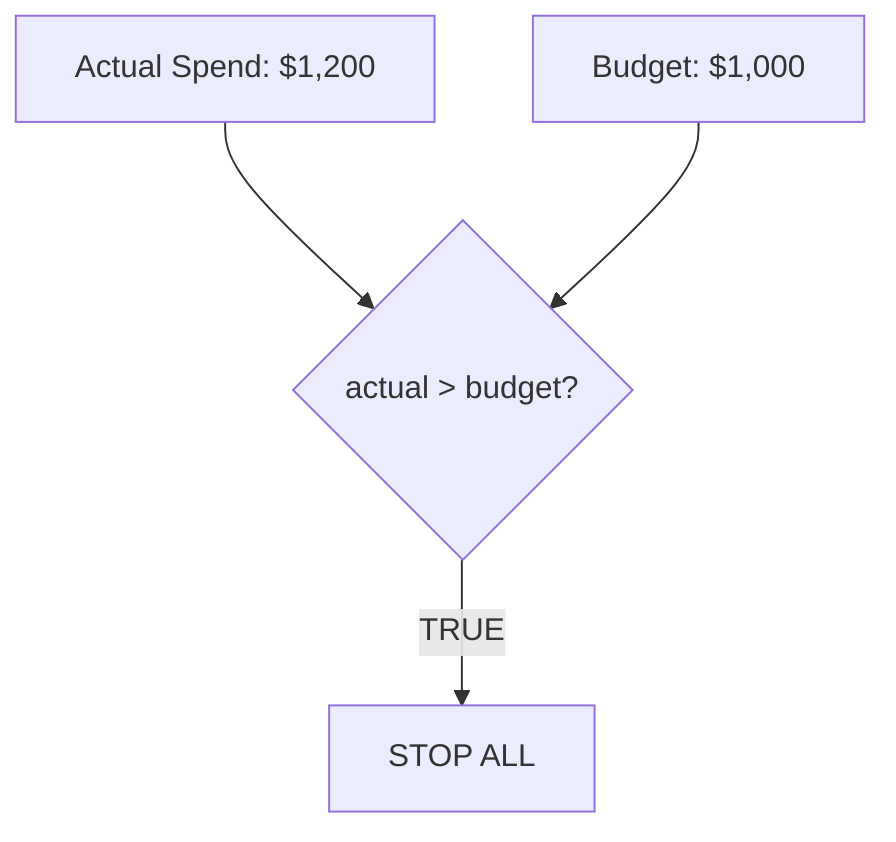

# Architecture

## How It Works

### Budget Projection



### Immediate Remediation

If actual spend already exceeds the budget, resources are stopped immediately
regardless of projected costs. This handles deployments to accounts that have
already overspent:



This ensures that deploying to an account that's already over budget triggers
immediate protection - no waiting for the next projection cycle.

### Lambda Cost Projection

Lambda costs are calculated from CloudWatch metrics:

```text
invocations_per_hour = CloudWatch Invocations / lookback_hours
gb_seconds_per_hour = (duration_ms / 1000) * (memory_mb / 1024)

hourly_cost = invocations x $0.0000002
            + gb_seconds x $0.0000166667
```

Example with real data:

```text
Function: data-transformer (256MB memory)
Last 24h: 52,000 invocations, 4.3 hours total duration

Hourly rate:   2,166 invocations/hour
GB-seconds:    162/hour
Hourly cost:   $0.0004 (requests) + $2.70 (compute) = $2.70/hour
Daily cost:    $64.80
Monthly:       ~$1,950
```

## What Gets Stopped

| Service | Action |
|---------|--------|
| EC2 | `stop_instances` |
| RDS | `stop_db_instance` |
| Lambda | `put_function_concurrency(0)` |
| App Runner | `pause_service` |
| ECS Fargate | `update_service(desiredCount=0)` |

## Alert Suppression

Alerts are only sent when actual changes are made:
- EC2/RDS already stopped - not discovered, no action needed
- Lambda already throttled (concurrency=0) - detected, skipped

This prevents duplicate alerts on repeated runs when resources are already remediated.

## IAM Permissions

```json
{
  "Action": [
    "ce:GetCostAndUsage",
    "ec2:DescribeInstances",
    "ec2:StopInstances",
    "rds:DescribeDBInstances",
    "rds:StopDBInstance",
    "lambda:ListFunctions",
    "lambda:GetFunctionConcurrency",
    "lambda:PutFunctionConcurrency",
    "apprunner:ListServices",
    "apprunner:DescribeService",
    "apprunner:PauseService",
    "ecs:ListClusters",
    "ecs:ListServices",
    "ecs:DescribeServices",
    "ecs:DescribeTaskDefinition",
    "ecs:UpdateService",
    "cloudwatch:GetMetricStatistics",
    "sns:Publish",
    "pricing:GetProducts",
    "ssm:GetParameter",
    "sts:GetCallerIdentity",
    "iam:ListAccountAliases",
    "organizations:DescribeOrganization"
  ]
}
```
